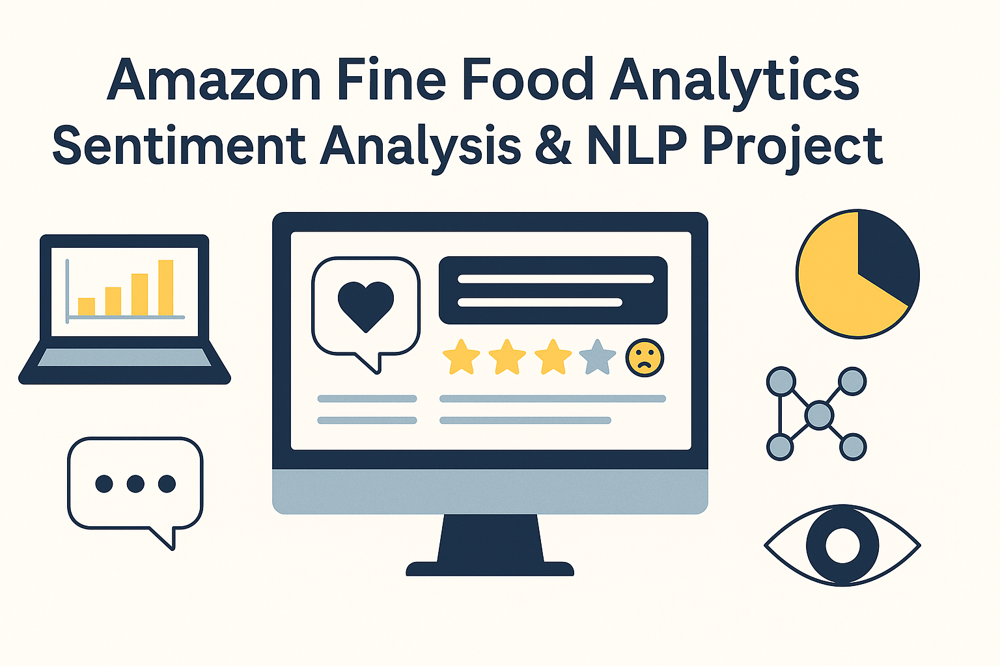

<p align="center"><strong>Amazon Fine Food Reviews — Sentiment Analysis & Interactive Analytics</strong></p> <p align="center"></p> <p align="center">      </p>

** Live Demo
Try the interactive Streamlit app here:
👉 https://amazon-fine-food-analytics-jxb5pkgnmmkkrjuwtu5upj.streamlit.app
> End-to-end natural language processing pipeline built around the **Amazon Fine Food Reviews** dataset. This project covers data ingestion preprocessing, modeling, evaluation, topic analysis, dashboard extracts, and a Streamlit interface for real-time sentiment predictions.

## Highlights
- **Full workflow**: raw Kaggle download → preprocessing → TF-IDF features → model selection → dashboard-ready outputs.
- **Production-ready artifacts**: serialized TF-IDF vectorizer, best-performing LinearSVC, and comparison metrics for alternative models.
- **Interactive demo**: Streamlit app (`app.py`) that loads saved artifacts to classify any review as positive or negative.
- **Exploratory notebooks**: reproducible notebooks for EDA, feature engineering, and experiment tracking.
- **Visualization assets**: curated CSV summaries in `Dashboards/` so dashboards can be refreshed without re-running notebooks.

## Table of Contents
1. [Project Overview](#project-overview)
2. [Business Question Solved](#business-question-solved)
3. [Key Features & Stack](#key-features--stack)
4. [Quick Start](#quick-start)
5. [Installation & Setup](#installation--setup)
6. [Repository Structure](#repository-structure)
7. [Data Sources](#data-sources)
8. [Modeling Pipeline](#modeling-pipeline)
9. [Streamlit App](#streamlit-app)
10. [Power BI Dashboard](#Power-BI-Dashboard)
11. [Notebooks & Dashboards](#notebooks--dashboards)
12. [Results Snapshot](#results-snapshot)
13. [Reproducibility Notes](#reproducibility-notes)
14. [Contributing](#contributing)
15. [License](#license)
16. [Contact](#contact)

## Project Overview
`Amazon Fine Food Analytics` demonstrates how classic NLP techniques can still deliver strong and explainable sentiment models. The goal is to give data scientists, analysts, and ML enthusiasts a concise blueprint for taking a noisy text dataset and turning it into:

- Clean, labeled data ready for experimentation
- Benchmark-ready notebooks with visuals and statistics
- Lightweight artifacts that can power web apps, dashboards, or downstream services

The project focuses on **binary sentiment classification** (positive vs negative). Neutral 3-star reviews are filtered out to sharpen the class boundary.

## Business Question Solved
**Question**: How can marketplace, vendor management, and CX teams triage product quality issues without reading hundreds of thousands of reviews?

This pipeline helps them:
- Detect high-risk SKUs when negative-review ratios jump
- See which factors are driving complaints (freshness, flavor, delivery, packaging)
- Prioritize supplier outreach and track whether changes improve sentiment

With saved artifacts and dashboards, teams get a measurable, self-serve feedback loop instead of manual review triage.

## Key Features & Stack
- **Language**: Python 3.9 (tested 3.9+, compatible with 3.8+)
- **Libraries**: `pandas`, `scikit-learn`, `nltk`, `xgboost`, `wordcloud`, `matplotlib`, `seaborn`, `streamlit`
- **Modeling**: TF-IDF features, LinearSVC baseline, alternative classifiers benchmarked in `Models/Model Comparison Results.csv`
- **Artifacts**: `Models/best_sentiment_model.pkl`, `Models/tfidf_vectorizer.pkl`, and `Models/sentiment_pipeline.pkl` ready to load
- **App**: Streamlit UI with cached model loading and prediction confidence

## Quick Start
```bash
git clone https://github.com/ChelseaVadlapati/Amazon-Fine-Food-Analytics.git
cd "Amazon Fine Food Analytics"
python3 -m venv .venv
source .venv/bin/activate
pip install -r requirements.txt
streamlit run app.py

```

## Installation & Setup
1. **Python**: Use Python 3.9 if possible (3.8+ works).  
2. **Virtual environment**: `python3 -m venv .venv` then activate (`source .venv/bin/activate` on macOS/Linux, `.venv\Scripts\activate` on Windows).  
3. **Dependencies**:
   ```bash
   pip install -r requirements.txt
   # optional: include experimentation extras
   pip install -r Requirements_Full_Dev.txt
   ```
4. **Data availability**: `Data Raw/Reviews.csv` is provided. If you want to re-download, grab the [Kaggle Amazon Fine Food Reviews dataset](https://www.kaggle.com/datasets/snap/amazon-fine-food-reviews) and replace this file.
5. **Environment variables**: none required. Artifacts live in `Models/` so the Streamlit app works offline.

## Repository Structure
```
Assets/                     # branding images, GIFs, banner used in docs/app
Dashboards/                 # CSV summaries of sentiment trends and word stats
Data Raw/                   # original Kaggle dataset(s)
Data Processed/             # cleaned and labeled datasets ready for modeling
Models/                     # serialized TF-IDF vectorizer, best model, metrics
Notebooks/                  # Jupyter notebooks for EDA, modeling, summaries
app.py                      # Streamlit UI for real-time predictions
requirements.txt            # minimal dependencies to run the app + notebooks
Requirements_Full_Dev.txt   # extended packages used during exploration
sql/                        # optional SQL snippets for downstream warehousing
README.md                   # you are here
```

## Data Sources
- **Primary dataset**: `Data Raw/Reviews.csv` (Kaggle Amazon Fine Food Reviews, ~568k rows).  
- **Processing output**: `Data Processed/Cleaned Reviews.csv` containing deduplicated text, mapped sentiment labels, and engineered columns (token counts, helpfulness ratios, etc.).  
- **Dashboard extracts**: curated CSVs (e.g., `Sentiment_over_time.csv`, `Top positive words model coeffs.csv`) to plug into BI tools without heavy joins.  

Labeling scheme:
- Rating 1-2 → Negative  
- Rating 3 → Neutral (dropped during training)  
- Rating 4-5 → Positive  

Neutral reviews are preserved in notebooks for descriptive analytics but excluded from the final binary classifier.

## Modeling Pipeline
1. **Text cleaning** – lowercase, punctuation stripping, stop word removal, lemmatization via `nltk`.  
2. **Feature engineering** – TF-IDF representation with unigrams + bigrams and min-df thresholding.  
3. **Model selection** – compare LinearSVC, Logistic Regression, XGBoost, and ensemble variants (see `Models/Model Comparison Results.csv`).  
4. **Evaluation** – accuracy, precision/recall/F1, confusion matrices, word importance tables.  
5. **Artifact packaging** – persist the winning model + TF-IDF vectorizer with `joblib` for downstream use.  

The Streamlit app loads exactly these artifacts, so any retraining workflow should overwrite the files inside `Models/`.

## Streamlit App
- File: `app.py`  
- Command: `streamlit run app.py`  
- Live demo: [amazon-fine-food-analytics.streamlit.app](https://amazon-fine-food-analytics-9f58bkz2chfpgw2kkp5vwg.streamlit.app)
- Features:
  - Sidebar instructions + project blurb
  - Preset example buttons for fast demos
  - Confidence heuristic derived from the decision margin
  - Styled card for results and the analyzed review text

## App Demo
<p align="center">
  
</p>

If model artifacts are missing, the app displays a friendly error with traceback so deployment troubleshooting is easy.

## Power BI Dashboard
Power BI Dashboard — Amazon Fine Food Analytics:
An interactive three-page Power BI report built using the cleaned dataset (Cleaned Reviews.csv).
The dashboard provides a visual storytelling layer on top of the NLP and modeling pipeline, allowing non-technical users to explore sentiment patterns, rating behaviors, and customer pain points.
- Live Dashboard: https://app.powerbi.com/view?r=eyJrIjoiMWRiODQ4N2UtMzBiYS00ZmE4LTgyMmUtMTllOWVhMDRmYzA4IiwidCI6IjBkNGRhMGY4LTRhMzEtNGQ3Ni1hY2U2LTBhNjIzMzFlMWI4NCIsImMiOjF9&pageName=e8420c30b137a60b4595

### Dashboard Pages

1. Overview — Summary of Insights
A high-level snapshot of customer satisfaction across 568k Amazon Fine Food reviews.
Includes:
- Total number of reviews
- Average rating
- Rating distribution
- Sentiment distribution
- Global slicers (Rating, Date)
Purpose: Quickly assess overall customer experience before diving deeper.

2. Trends Over Time — Customer Behavior Insights
Time-series visuals reveal how customer engagement and sentiment have changed across 1999–2012.
Includes:
- Average rating over time
- Review volume over time
- Sentiment trend (Positive / Neutral / Negative)
Purpose: Identify long-term shifts in customer behavior and feedback patterns.

3. Negative Review Drilldown — Understanding Customer Pain Points
A focused diagnostic page that highlights where and why negative sentiment occurs.
Includes:
- Products with the most negative reviews
- Examples of customer complaints
- Length of negative reviews (indicator of strong emotion)
- Helpfulness of negative reviews
Purpose: Surface actionable insights to improve product quality and customer satisfaction.

### Key Skills Demonstrated (Power BI)
Data modeling and transformation through Power Query
DAX measures for date conversion and sentiment grouping
Report layout, page theming, and cohesive color design
KPI cards, slicers, drilldown exploration, and storytelling UI
Integration of NLP outputs into BI dashboards

### How the Dashboard Connects to the NLP Pipeline
This dashboard was built using the same cleaned dataset and engineered features used for:
- Sentiment classification
- Trend analysis
- Review length patterns
- Helpfulness ratios
It complements the Streamlit model by giving analysts and business stakeholders a visual, self-serve way to explore the dataset without writing code.

## Notebooks & Dashboards
| Notebook | Purpose |
| --- | --- |
| `Notebooks/01_data_cleaning_and_EDA.ipynb` | Cleans raw reviews, performs exploratory analysis, word clouds, sentiment timelines. |
| `Notebooks/02_model_sentiment.ipynb` | Builds pipelines, trains multiple classifiers, logs metrics, exports artifacts. |
| `Notebooks/03_summary_metrics.ipynb` | Generates aggregated KPIs and CSVs for dashboards. |

Dashboard-ready CSVs (in `Dashboards/`) include sentiment distributions, rating trends, top positive/negative word lists from both raw counts and model coefficients.

## Results Snapshot
- **Best model**: LinearSVC on TF-IDF features
- **Accuracy**: ~95.0%
- **Negative class F1**: ~83%
- **Artifacts**: `Models/best_sentiment_model.pkl`, `Models/tfidf_vectorizer.pkl`
- **Insights**:
  - Positive reviews emphasize flavor, freshness, delivery speed
  - Negative reviews highlight stale products, damaged packaging, inconsistency
  - Sentiment trends align strongly with 4–5 star dominance but highlight pockets of dissatisfaction during holiday seasons (see Dashboards)

For granular metrics, open `Models/Model Comparison Results.csv` or re-run the modeling notebook to regenerate tables and figures.

## Reproducibility Notes
- **Dependency pinning**: `requirements.txt` for runtime; `Requirenments_Full_Dev.txt` captures optional extras (e.g., notebooks, visualization libraries).  
- **Determinism**: random seeds are set in notebooks where estimators support it.  
- **Data versioning**: raw and processed CSVs are checked in for convenience; refresh them if you want to apply different preprocessing choices.  
- **Regeneration**: run notebooks sequentially (`01` → `02` → `03`). Each notebook saves intermediate outputs so you can safely resume.

## Contributing
1. Fork the repo and create a branch: `git checkout -b feature/awesome-idea`
2. Keep data paths consistent (use the provided folder names)
3. Update notebooks / docs / dashboards relevant to your change
4. Run `streamlit run app.py` locally if you modify artifacts or UI
5. Submit a PR describing the motivation, approach, and validation

Bug reports, enhancement proposals, and dashboard ideas are all welcome—open an issue to start the convo.

## License
Distributed under the MIT License. Add a `LICENSE` file if you intend to publish the repo broadly; the shields badge assumes MIT.

## Contact
**Thilisitha Chelsea Vadlapati** — Data Analyst & NLP / ML Enthusiast  
- LinkedIn: _https://www.linkedin.com/in/chelseavadlapati/_  
- Email: _chelseavadlapati@gmail.com_  

If you use the project or extend it, share a link—I’d love to see the variations!
